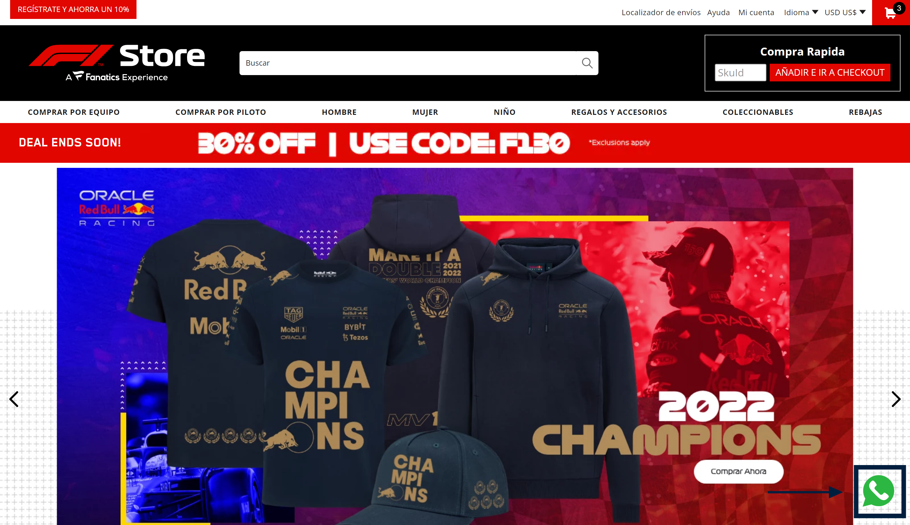

# Whatsapp Button

<!-- DOCS-IGNORE:start -->
<!-- ALL-CONTRIBUTORS-BADGE:START - Do not remove or modify this section -->
[](#contributors-)
<!-- ALL-CONTRIBUTORS-BADGE:END -->
<!-- DOCS-IGNORE:end -->

The WhatsApp Button component allows customers to directly contact the e-commerce by sending a message to a whatsapp number regarding any doubt, question or even to proceed to purchase some product. To execute the component the customer has to press the button that will redirect him to the whatsapp application.

 


## Configuration 

### Step 1 - Adding the Whatsapp Button app to your theme's dependencies

In your theme's `manifest.json`, add the Whatsapp Button app as a dependency:

```json
  "dependencies": {
    "itgloberspartnercl.whatsapp-button": "0.x"
  }
```

### Step 2 - Declaring the block on the page you want it to be displayed

Now, you can use the block exported by the `whatsapp-button` app.

#### `whatsapp-button` blocks
 Block name   | Description  |
| -------- | ------------------------ |
| `whatsapp-button`     |   Enables you to render the whatsapp button, it can be use at any page of the website.                                      

```json
  "store.home": {
    "blocks": [
        "responsive-layout.desktop"
    ]
  },
  "responsive-layout.desktop": {
    "children": [
        "whatsapp-button"
    ]
  }
```

### Step 2 - Defining the props that the component will have

Check all props to configure the block in the table below:

### `whatsapp-button` props

| Prop name    | Type            | Description    | Default value                                                                                                                               |
| ------------ | --------------- | --------------------------------------------------------------------------------------------------------------------------------------------- | ---------- | 
| `logo`      | `string`       | The logo parameter defines the whatsapp icon that the component will render. Define the path of the icon as the value of this parameter. | `undefined`        |
| `phone`      | `string`       | Phone parameter establish the whatsapp number that the customer will be redirect once he press the component. It is important to mention that before the whatsapp number, the calling code of the country must be declared. E.g. "+573152768890" where "+57" is the numerical code of Colombia.  | `undefined`        |
| `message`      | `string`       | Message parameter defines the default message that customers will see and be able to send when entering the whatsapp chat, however, it can be edited by the customer | `¡Hello! I want more information`        |

## Customization

In order to apply CSS customizations in this and other blocks, follow the instructions given in the recipe on [Using CSS Handles for store customization](https://vtex.io/docs/recipes/style/using-css-handles-for-store-customization).

| CSS Handles |
| ----------- | 
| `whatsapp__container` | 
| `whatsapp__logo` | 

<!-- DOCS-IGNORE:start -->

## Contributors ✨

1. Hugo Felipe Riveros Fajardo

---- 

Check out some documentation models that are already live: 
- [Breadcrumb](https://github.com/vtex-apps/breadcrumb)
- [Image](https://vtex.io/docs/components/general/vtex.store-components/image)
- [Condition Layout](https://vtex.io/docs/components/all/vtex.condition-layout@1.1.6/)
- [Add To Cart Button](https://vtex.io/docs/components/content-blocks/vtex.add-to-cart-button@0.9.0/)
- [Store Form](https://vtex.io/docs/components/all/vtex.store-form@0.3.4/)
